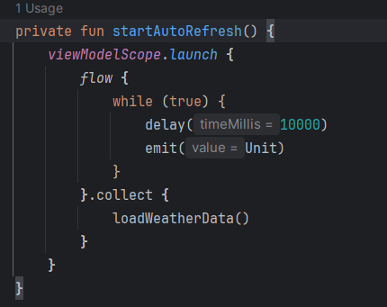
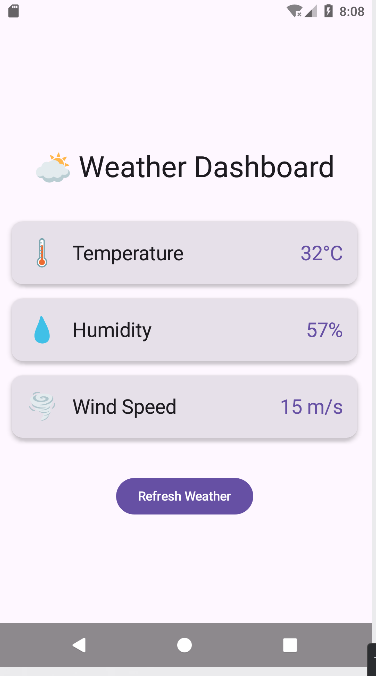

# WeatherDashboard

Учебное Android-приложение для демонстрации работы корутин в Kotlin. Приложение имитирует загрузку данных о погоде из нескольких источников, показывает индикаторы загрузки и позволяет сравнивать последовательный и параллельный подходы к выполнению асинхронных операций.

## Функциональность

- Загрузка данных о температуре, влажности и скорости ветра с искусственной задержкой (имитация сети)
- Отображение индикаторов загрузки для каждого параметра
- Ручное обновление данных по нажатию кнопки Refresh
- Имитация ошибки сети для проверки обработки исключений
- Расчёт "индекса погоды" с тяжёлыми вычислениями (для демонстрации Dispatchers.Default)
- Автоматическое обновление данных каждые 10 секунд
- Корректная обработка ошибок без падения приложения
- Отображение прогресса загрузки в текстовом виде

## Технологии и библиотеки

- **Язык:** Kotlin
- **UI:** Jetpack Compose
- **Асинхронность:** Kotlin Coroutines
- **Архитектура:** ViewModel + StateFlow
- **Зависимости:**
    - `androidx.lifecycle:lifecycle-viewmodel-compose:2.7.0`
    - `org.jetbrains.kotlinx:kotlinx-coroutines-android:1.7.3`
    - `org.jetbrains.kotlinx:kotlinx-coroutines-core:1.7.3`

## Контрольные вопросы

### 1. В чём разница между launch и async?
*   **`launch`** используется для выполнения операции, результат которой не нужен ("запустил и забыл"). Он возвращает объект `Job`, который можно использовать для управления корутиной (например, отмены).
*   **`async`** используется, когда ожидается возвращаемый результат. Он возвращает объект `Deferred<T>`, и для получения результата необходимо вызвать функцию `await()`.

**Когда использовать:**
*   `launch`: для отправки логов, обновления UI, выполнения фоновых задач, результат которых не требуется.
*   `async`: для параллельной загрузки данных из нескольких источников (API, база данных), когда нужно дождаться всех результатов для дальнейшей обработки.

**Пример кода:**
```kotlin
// launch - запуск задачи без возврата результата
viewModelScope.launch {
    saveDataToDatabase() // ничего не возвращаем
}

// async - запуск задач с получением результатов
viewModelScope.launch {
    val deferred1 = async { loadUserData() }
    val deferred2 = async { loadSettings() }
    
    // Ждем оба результата
    val userData = deferred1.await()
    val settings = deferred2.await()
    
    // Используем оба результата
    updateUI(userData, settings)
}
```
### 2. Что такое suspend функция?
`suspend` функция — это функция, которая может приостанавливать свое выполнение, не блокируя поток, в котором она выполняется, и возобновлять его позже. Она может вызываться **только из другой suspend функции или из корутины** (например, из `launch` или `async`), вызвать ее из обычной функции напрямую не получится.

**Почему `delay()` не блокирует поток?**

`delay()` является suspend-функцией, которая приостанавливает только текущую корутину, но не блокирует поток, в котором она выполняется. В отличие от `Thread.sleep()`, который останавливает весь поток на указанное время, `delay()` позволяет потоку выполнять другие корутины или задачи, пока текущая ожидает возобновления.

### 3. Зачем нужны разные диспетчеры?
Диспетчеры определяют, на каких потоках (или пулах потоков) будет выполняться корутина. Разные диспетчеры нужны для оптимального распределения задач: UI-операции должны выполняться на главном потоке, тяжелые вычисления — на фоновых потоках, а ввод-вывод — на специально оптимизированных для этого потоках.

**Таблица с 3 диспетчерами и примерами задач:**

| Диспетчер | Когда использовать | Пример задачи |
|-----------|-------------------|---------------|
| `Dispatchers.Main` | Обновление UI, работа с элементами интерфейса | Изменение текста в `TextView`, показ `Toast`, обновление `StateFlow` в ViewModel |
| `Dispatchers.IO` | Сетевые запросы, работа с файлами, базами данных | Загрузка данных из API, чтение/запись в файл, операции с Room Database |
| `Dispatchers.Default` | Тяжелые вычисления, обработка больших данных | Сортировка большого массива, обработка изображений, сложные математические расчеты |

**Что будет, если выполнить тяжелое вычисление на `Dispatchers.Main`?**

Если выполнить тяжелое вычисление на `Dispatchers.Main`, главный поток (UI-поток) будет заблокирован на время выполнения операции. Это приведет к "зависанию" интерфейса приложения — экран перестанет реагировать на касания, анимации остановятся, и через несколько секунд система покажет диалог "Приложение не отвечает" (ANR — Application Not Responding).

```kotlin
// ПЛОХО: блокировка UI-потока
viewModelScope.launch(Dispatchers.Main) {
    // Тяжелое вычисление на главном потоке → ANR!
    for (i in 1..100000000) { 
        // сложная операция
    }
    textView.text = "Готово"
}

// ХОРОШО: тяжелые вычисления на Dispatchers.Default
viewModelScope.launch(Dispatchers.Main) {
    val result = withContext(Dispatchers.Default) {
        // Тяжелое вычисление в фоне
        for (i in 1..100000000) { 
            // сложная операция
        }
        "Готово"
    }
    textView.text = result // обновление UI на главном потоке
}
```

### 4. Что произойдёт, если не обработать исключение в корутине?
Если не обработать исключение в корутине, оно распространится вверх по иерархии — при использовании `launch` в `viewModelScope` исключение приведет к крашу приложения (FATAL EXCEPTION), а при использовании `async` без `await()` исключение может остаться незамеченным, но при вызове `await()` оно будет проброшено. Вложенные корутины без `SupervisorJob` или `coroutineScope` также могут отменить родительскую корутину при возникновении ошибки.

**Как корректно обрабатывать ошибки?**

Ошибки в корутинах обрабатываются с помощью:
1. `try-catch` блока внутри корутины
2. Использования `CoroutineExceptionHandler` (для глобальной обработки)
3. `SupervisorJob` + `try-catch` для изолированных дочерних корутин
4. `coroutineScope { }` с общим `try-catch` для группы операций

**Зачем нужен `try-catch` внутри `launch`?**

`try-catch` внутри `launch` необходим для локальной обработки ошибок, чтобы предотвратить краш приложения и корректно обработать исключение (показать сообщение пользователю, сохранить состояние, выполнить fallback-логику). Без `try-catch` любое исключение в корутине, запущенной через `launch`, приведет к необработанной ошибке и падению приложения.

```kotlin
// ПЛОХО: исключение приведет к крашу приложения
viewModelScope.launch {
    val data = repository.fetchTemperature() // если здесь Exception → CRASH!
    _state.value = data
}

// ХОРОШО: обработка ошибки внутри launch
viewModelScope.launch {
    try {
        val data = repository.fetchTemperature()
        _state.value = data
    } catch (e: Exception) {
        _state.value = _state.value.copy(
            error = "Ошибка: ${e.message}",
            isLoading = false
        )
    }
}

// ХОРОШО: группировка операций с coroutineScope для единой обработки
viewModelScope.launch {
    try {
        coroutineScope {
            val temp = async { repository.fetchTemperature() }
            val hum = async { repository.fetchHumidity() }
            _state.value = WeatherData(
                temperature = temp.await(),
                humidity = hum.await()
            )
        }
    } catch (e: Exception) {
        _state.value = _state.value.copy(
            error = "Ошибка загрузки: ${e.message}"
        )
    }
}
```
### 5. Как работает автоматическая отмена корутин?
Автоматическая отмена корутин работает за счет иерархической структуры: когда родительская область видимости (scope) отменяется, все дочерние корутины автоматически отменяются рекурсивно. Корутины проверяют статус отмены на точках приостановки (например, `delay()`, `yield()`, `await()`) и при обнаружении отмены выбрасывают `CancellationException`, корректно завершая работу.

**Что такое `viewModelScope`?**

`viewModelScope` — это встроенная область видимости для корутин в архитектурном компоненте ViewModel, которая автоматически привязана к жизненному циклу ViewModel. Она наследует `Dispatchers.Main` по умолчанию и автоматически отменяет все запущенные в ней корутины, когда ViewModel уничтожается (например, при закрытии экрана или завершении Activity).

**Когда корутины отменяются автоматически?**

Корутины отменяются автоматически в следующих случаях:
1. При уничтожении ViewModel (для `viewModelScope`)
2. При завершении жизненного цикла `LifecycleOwner` (при использовании `lifecycleScope`)
3. При отмене родительской корутины или области видимости
4. При возникновении необработанного исключения в родительской корутине (если не используется `SupervisorJob`)

```kotlin
class WeatherViewModel : ViewModel() {
    
    init {
        // viewModelScope привязан к жизненному циклу ViewModel
        viewModelScope.launch {
            // Эта корутина будет жить, пока жива ViewModel
            loadWeatherData()
        }
        
        // Автоматическое обновление каждые 10 секунд
        startAutoRefresh()
    }
    
    private fun startAutoRefresh() {
        viewModelScope.launch {
            while (true) {
                delay(10000) // точка приостановки, проверяет отмену
                loadWeatherData() 
                // Если ViewModel уничтожена — корутина отменится на delay()
            }
        }
    }
    
    fun loadWeatherData() {
        viewModelScope.launch {
            // При уничтожении ViewModel все эти корутины автоматически отменятся
            val temp = async { repository.fetchTemperature() }
            val humidity = async { repository.fetchHumidity() }
            
            // await() также проверяет статус отмены
            _weatherState.value = WeatherData(
                temperature = temp.await(),
                humidity = humidity.await()
            )
        }
    }
    
    // ViewModel.onCleared() вызывается автоматически при уничтожении
    // Все корутины в viewModelScope отменяются ДО вызова onCleared()
    override fun onCleared() {
        super.onCleared()
        // Здесь корутины уже отменены, ресурсы освобождены
    }
}

// Пример проверки отмены в suspend функции
suspend fun performTask() {
    // Проверка отмены вручную
    coroutineContext.ensureActive()
    
    // Или использование yield() для проверки отмены
    yield()
    
    // delay() автоматически проверяет отмену
    delay(1000) // если корутина отменена — выбросит CancellationException
}
```
## Как запустить проект

1. **Клонируйте репозиторий**  
   Откройте терминал и выполните команду:
   ```bash
   git clone https://github.com/AnastasiaZlamanyuk/AndroidStudio_Lab17-18.git
2. **Откройте проект в Android Studio**
Запустите Android Studio, выберите **File → Open** и укажите путь к скачанному проекту.
3.  **Запустите приложение**
Подключите устройство по USB или создайте эмулятор (рекомендуется API 25+), затем нажмите кнопку **Run** (зелёный треугольник) или используйте сочетание клавиш `Shift + F10`.

## Скриншоты работы приложения


* Автор: Зламанюк А.А.; Телятникова Е.П.
* 01.04.2026 г.